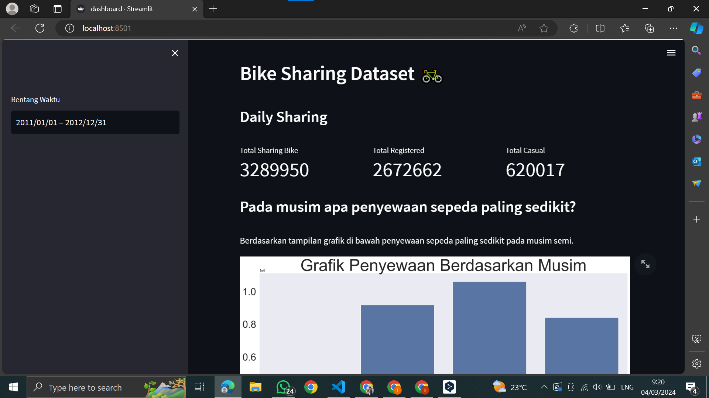
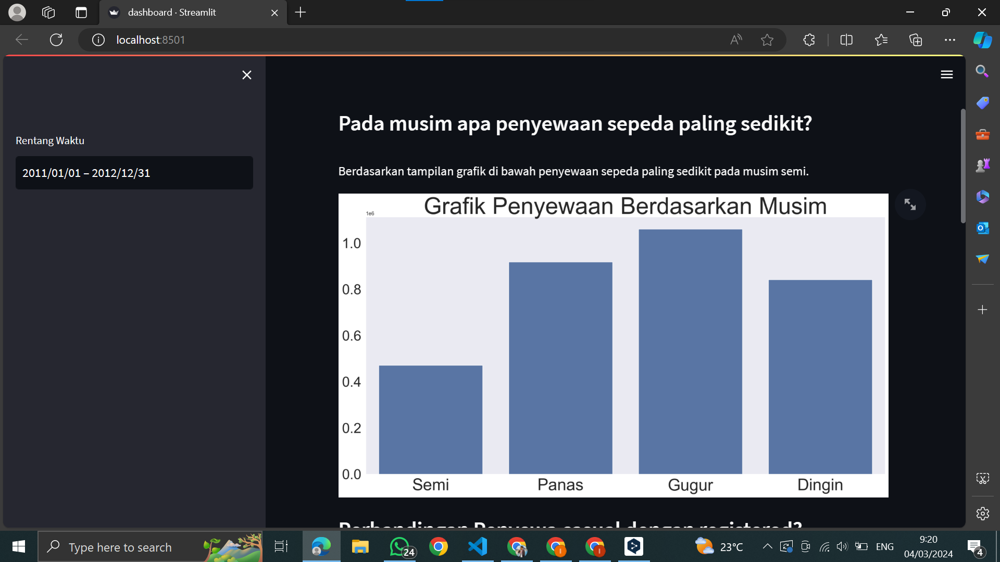
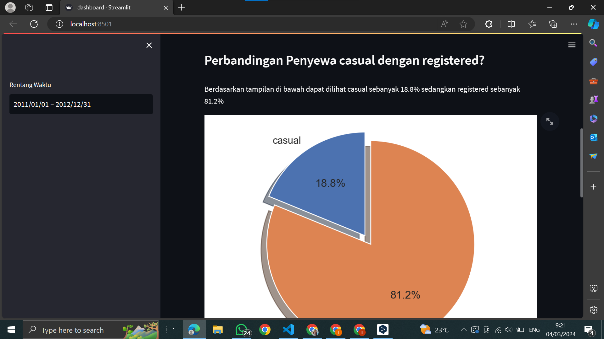
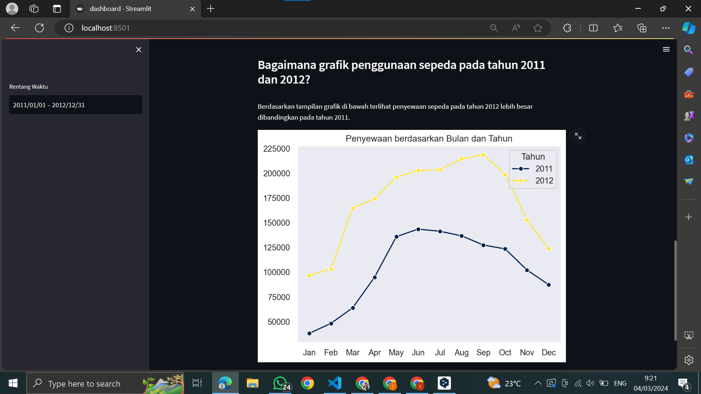

# Submission Dicoding "Belajar Analisis Data dengan Python" Bike Sharing Dataset

## Deskripsi

Ini adalah tugas akhir dari Dicoding dalam mata kuliah "Belajar Analisis Data Dengan Python" untuk membuat analisis dan membuat dashboard dari dataset bike sharing. Dalam file notebook tersebut, saya melampirkan cara saya melakukan analisis mulai dari Data Wrangling, Exploratory Data Analysis, dan Data Visualization.

## Struktur Direktori

- **/data**: Direktori ini berisi data yang digunakan dalam proyek, dalam format .csv .
- **/dashboard**: Direktori ini berisi main.py yang digunakan untuk membuat dashboard hasil analisis data.
- **notebook.ipynb**: File ini yang digunakan untuk melakukan analisis data.

## Getting Started
### `notebook.ipynb`
1. Unduh proyek ini.
2. Buka IDE favorit Anda seperti Jupyter Notebook atau Google Colaboratory (tapi di sini saya akan menggunakan Google Colab).
3. Buatlah sebuah Notebook Baru.
4. Unggah dan pilih file dengan ekstensi .ipynb.
5. Sambungkan ke runtime yang dihosting.
6. Terakhir, jalankan sel kode.

### `dashboard/dashboard.py`
1. Unduh proyek ini.
2. Instal Streamlit pada terminal atau command prompt Anda dengan menggunakan `pip install streamlit`. Instal pustaka lain seperti pandas, numpy, scipy, matplotlib, dan seaborn jika Anda belum melakukannya.
3. Harap dicatat, jangan memindahkan file csv karena ia bertindak sebagai sumber data. simpan dalam satu folder sebagai dashboard.py
4. Buka VSCode Anda dan jalankan file tersebut dengan mengklik terminal dan tuliskan `streamlit run dashboard.py`.

## 4. Screenshots

